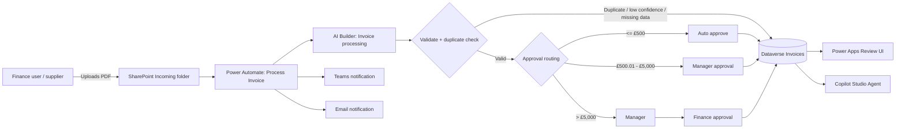

# Architecture

## Design choices

- **SharePoint** stores source documents; **Dataverse** stores structured workflow state.
- **AI Builder** extracts invoice values and confidence scores. Low confidence does not silently pass.
- Duplicate identity is the normalized `supplier_name|invoice_number`, backed by a Dataverse alternate key.
- Approval thresholds are environment configuration, not hard-coded business logic.
- The Copilot agent is read-only. It can retrieve status and review queues but cannot approve or pay an invoice.

## Manual-review re-entry

Power Apps never assigns `Pending Approval` directly. A reviewer corrects the extracted fields and sets `Ready for Validation`. `INV-04 - Revalidate Reviewed Invoice` then performs required-field checks, duplicate detection and approval routing in Power Automate. This prevents client-side bypass of finance controls.
